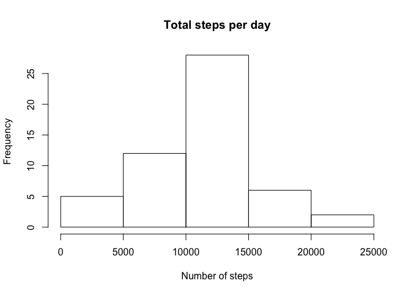
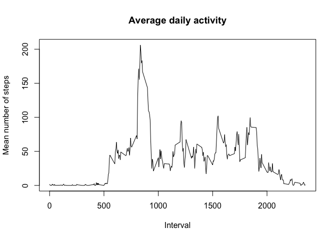
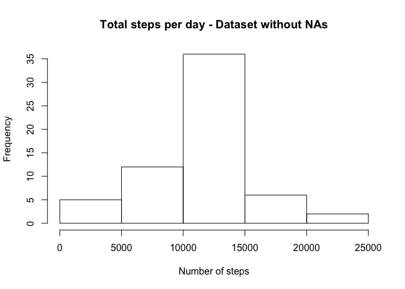
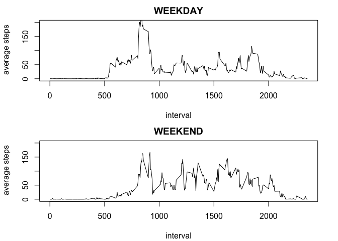

# Reproducible Research - Assesment 1
Damian Bikiel  
October 14, 2015  


#Loading and preprocessing the data
The first step of the work is to load the data:


```r
datos <- read.csv("activity.csv")
summary(datos)
```

```
##      steps                date          interval     
##  Min.   :  0.00   2012-10-01:  288   Min.   :   0.0  
##  1st Qu.:  0.00   2012-10-02:  288   1st Qu.: 588.8  
##  Median :  0.00   2012-10-03:  288   Median :1177.5  
##  Mean   : 37.38   2012-10-04:  288   Mean   :1177.5  
##  3rd Qu.: 12.00   2012-10-05:  288   3rd Qu.:1766.2  
##  Max.   :806.00   2012-10-06:  288   Max.   :2355.0  
##  NA's   :2304     (Other)   :15840
```

#What is mean total number of steps taken per day?

In order to answer what is the mean total number of steps per day, we have to aggregate the steps per day. To do this, I created the variable ``steps_per_day``, which contains for each date, the total number of steps:


```r
steps_per_day <- NULL
days <- unique(datos$date)
for (i in 1:length(days)){
        steps_per_day[i] <- sum(datos$step[datos$date == days[i]])       
}

hist(steps_per_day, main = "Total steps per day", xlab = "Number of steps")
```

 

The mean and median number of steps per day can be computed as follow:


```r
mean_steps <- mean(steps_per_day, na.rm = TRUE)
median_steps <- median(steps_per_day, na.rm = TRUE)
```

The <b>mean</b> value is <b>10766.19 steps</b>, while the <b>median</b> is <b>10765 steps</b>.

#What is the average daily activity pattern?

In order to compute the daily average pattern, we have to aggregate the data per interval, instead of day. To do this, we can compute:


```r
steps_per_interval <- NULL
intervals <- unique(datos$interval)
for (i in 1:length(intervals)){
        steps_per_interval[i] <- mean(datos$step[datos$interval == intervals[i]], na.rm = TRUE)       
}

plot(intervals, steps_per_interval, main = "Average daily activity", xlab = "Interval", ylab = "Mean number of steps", type = "l")
```

 

The <b>interval</b> containing the <b>maximum number of steps in the day (averaged over all the days)</b> correspond to <b>835</b>.

#Imputing missing values

The number of missing values (NA) can be computed using:


```r
missing_values <- sum(is.na(datos$steps))
```

The <b>total number of missing values</b> is <b>2304</b>.

One potential strategy to fill the missing values is to use the integer value of the corresponding mean 5-minute interval:


```r
datos_noNA <- datos
for (i in 1:length(datos_noNA$steps)){
        if (is.na(datos_noNA$steps[i])) {
                datos_noNA$steps[i] <- as.integer(steps_per_interval[intervals == datos_noNA$interval[i]])}
        }
```

Now, we can recalculate the mean and median values for the new dataset:


```r
steps_per_day_noNA <- NULL
for (i in 1:length(days)){
        steps_per_day_noNA[i] <- sum(datos_noNA$step[datos_noNA$date == days[i]])       
}

hist(steps_per_day_noNA, main = "Total steps per day - Dataset without NAs", xlab = "Number of steps")
```

 

```r
mean_steps_noNA <- mean(steps_per_day_noNA)
median_steps_noNA <- median(steps_per_day_noNA)
```

The new <b>mean</b> and <b>median</b> are <b>10749.77</b> and <b>10641</b>, respectively. The values are almost unchanged from the original data; there is a difference of -16.42 steps for the mean and of -124 steps for the median, which corresponds to -0.15% and -1.15% from the original mean and median values, respectively. In other words, the impact of adding the missing data is negligible.

#Are there differences in activity patterns between weekdays and weekends?

In order to study the potential difference between weekdays and weekends, we can compute for each day to which category belongs and generate the average steps per day, averaged per category and interval:


```r
weekend <-NULL
weekend <- weekdays(as.Date(datos_noNA$date))
id <- weekend == "Sunday" | weekend == "Saturday"
weekend[id] <- "weekend"
weekend[!id] <- "weekday"
weekend <- as.factor(weekend)
datos_noNA <- cbind(datos_noNA,weekend)

steps_per_interval_weekday <- NULL
intervals <- unique(datos$interval)
for (i in 1:length(intervals)){
        steps_per_interval_weekday[i] <- mean(datos_noNA$step[datos_noNA$interval == intervals[i] & datos_noNA$weekend == "weekday"])       
}

steps_per_interval_weekend <- NULL
intervals <- unique(datos$interval)
for (i in 1:length(intervals)){
        steps_per_interval_weekend[i] <- mean(datos_noNA$step[datos_noNA$interval == intervals[i] & datos_noNA$weekend == "weekend"])       
}

par(mfrow=c(2,1), mar = c(4,4,2,2)+0.1)
plot(intervals, steps_per_interval_weekday, type = "l", xlab = "interval", ylab = " average steps", ylim = c(0,200), main = "WEEKDAY")
plot(intervals, steps_per_interval_weekend, type = "l", xlab = "interval", ylab = " average steps", ylim = c(0,200), main = "WEEKEND")
```

 

From the plot it is possible to observe that there are differences in the patterns between weekends and weekdays. 
